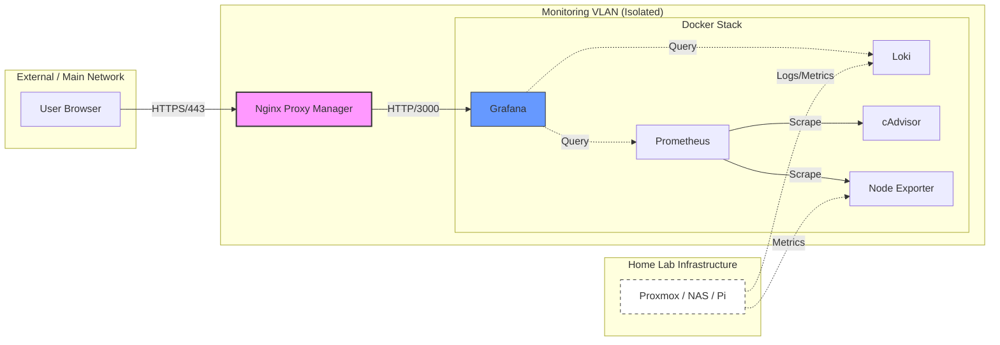

# 📊 Home Lab Monitoring Stack

A production-grade observability suite deployed via **GitHub Actions** to a **Raspberry Pi 4 8GB RAM**. This stack provides a "Single Pane of Glass" for monitoring a distributed Proxmox cluster, AI workloads (RTX 3090 Ti), and 20+ containerized applications.

---

## 🏗️ Architecture Overview
This monitoring stack utilizes a **Hybrid Storage Strategy** to balance high-performance metric ingestion with long-term data resilience.

* **Prometheus**: Time-series database running on local **EXT4 SSD storage** to ensure high IOPS and prevent TSDB corruption common with network filesystems.
* **Grafana & Loki**: Data persisted directly to a **15TB NAS (NFS Mount)** for high-capacity log retention and dashboard persistence.
* **Automated Backups**: Nightly snapshots of Prometheus data are pushed to the NAS via an automated script, providing 3-2-1 backup methodology.
* **Observability**: Integrated monitoring for a distributed Proxmox cluster, AI workloads (**RTX 3090 Ti**), and 20+ containerized applications.



---

## 🚀 Automated Deployment

This project utilizes a **GitOps** approach. Changes pushed to the `main` branch trigger a GitHub Action that:
1.  Validates the `docker-compose.yml` syntax.
2.  Securely transfers configurations via SCP to the Raspberry Pi.
3.  **Directory Initialization**: Automatically creates and sets UID 65534 (nobody) permissions for local SSD storage.
4.  **Idempotent Cron Management**: Dynamically manages crontab entries to schedule nightly NAS backups without duplication.
5.  **Service Orchestration**: Executes remote SSH commands to pull images and recreate containers with `--force-recreate`.

### Prerequisites
* GitHub Repository Secrets: `HOST`, `USERNAME`, `KEY`, `DOMAIN`, `GRAFANA_PASSWORD`.
* Raspberry Pi with Docker & Docker Compose installed.
* Node Exporter running on all monitored targets (Port 9100).

---

## 💾 Storage & Backup Strategy

| Data Type | Primary Storage | Backup Target | Strategy |
| :--- | :--- | :--- | :--- |
| **Prometheus TSDB** | Local SSD (EXT4) | 15TB NAS (NFS) | Nightly Admin API Snapshots |
| **Grafana DB** | 15TB NAS (NFS) | NAS RAID | Direct Persistence |
| **Loki Logs** | 15TB NAS (NFS) | NAS RAID | Direct Persistence |

### Automated Backups
A custom bash script (`/scripts/backup_prometheus.sh`) runs nightly via Cron. It:
1.  Triggers a Prometheus TSDB snapshot via the **Admin API**.
2.  Verifies the NAS mount point is active to protect local SSD capacity.
3.  Syncs the snapshot to the NAS using `rsync` with automated ownership correction.
4.  Purges the local snapshot to maintain SSD health.

---

## 🌐 Networking Configuration

To ensure compatibility with an external **Nginx Proxy Manager (NPM)** VM, services are bound to the host's LAN IP.

| Service | Internal Port | External Port | Access URL |
| :--- | :--- | :--- | :--- |
| **Grafana** | 3000 | 3000 | `grafana.domain.com` |
| **Prometheus** | 9090 | 9090 | `prometheus.domain.com` |
| **cAdvisor** | 8080 | 8081 | `cadvisor.domain.com` |
| **Loki** | 3100 | 3100 | `loki.domain.com` |

> [!NOTE]
> **cAdvisor** is mapped to `8081` on the host to avoid conflicts with local Nginx services, but Prometheus scrapes it internally on `8080` via the Docker bridge network.

> [!IMPORTANT]
> **Prometheus Admin API** is enabled (`--web.enable-admin-api`) to facilitate automated snapshots. Access is restricted via Nginx Proxy Manager and internal VLAN isolation.

---

## 🎯 Scrape Targets

The stack currently monitors **27 endpoints** across the Columbus Lab:

* **Hypervisors**: 3x Proxmox Nodes
* **AI Stack**: Dedicated AI node with **NVIDIA RTX 3090 Ti**
* **Core Services**: Technitium DNS, Nginx Proxy Manager, Home Assistant
* **Media Stack**: Plex, Sonarr, Radarr, qBittorrent, and more.

### Adding New Targets
Update `targets.json` and push to main:
```json
{
  "targets": ["new-service.YOUR.DOMAIN:9100"],
  "labels": { "job": "new_category" }
}
```
---

## 🛠️ Maintenance Cheatsheet

**Reset Grafana Admin Password:**
```bash
docker exec -it grafana grafana cli admin reset-admin-password 'your-new-password'
```

**Check Prometheus Scrape Status:**

Visit `http://<pi-ip>:9090/targets` to verify all endpoints are `UP`.

**View Logs:**

```bash
docker compose logs -f [service_name]
```

**Manually Trigger Prometheus Backup:**
```bash
~/docker/monitoring/scripts/backup_prometheus.sh
```

**Verify Last Night's Backup:**
```bash
ls -lh /mnt/monitoring/backups/prometheus
```

**Check Backup Logs:**
```bash
tail -f ~/docker/monitoring/backup.log
```
---

## ♻️ Disaster Recovery (Restore Procedure)

In the event of a local SSD failure or data corruption, follow these steps to restore Prometheus from a NAS snapshot:

1.  **Stop the Service**:
    ```bash
    docker compose stop prometheus
    ```
2.  **Clear Corrupted Data**:
    ```bash
    sudo rm -rf ~/docker/monitoring/prometheus_data/data/*
    ```
3.  **Restore from NAS**:
    Find the latest snapshot on your NAS and sync it back to the local SSD:
    ```bash
    # Replace [SNAPSHOT_NAME] with your target folder
    sudo rsync -av /mnt/monitoring/backups/prometheus/[SNAPSHOT_NAME]/ ~/docker/monitoring/prometheus_data/data/
    ```
4.  **Fix Permissions**:
    Ensure the Prometheus user (`65534`) owns the restored files:
    ```bash
    sudo chown -R 65534:65534 ~/docker/monitoring/prometheus_data/data
    ```
5.  **Restart Service**:
    ```bash
    docker compose up -d prometheus
    ```
---

## 🔒 Security Note: This stack is designed for a hardened home lab environment. It assumes:

**Network Isolation:** All containers run on a dedicated Monitoring VLAN.

**Reverse Proxy:** Traffic is handled via an internal Nginx Proxy Manager (NPM).

**Encryption:** Forced HTTPS/SSL via local certificates; all port 80/HTTP traffic is blocked at the firewall level.

**Access Control:** No direct WAN exposure; access is restricted to local/VPN clients.

---

Maintained by Nicolas Teixeira | 2026
