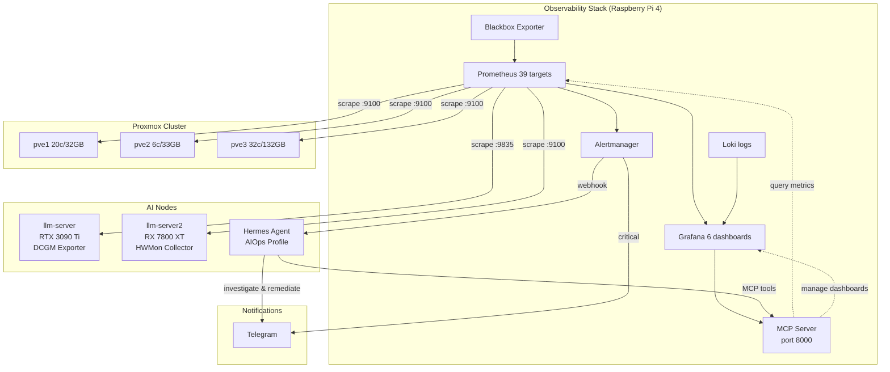

# 📊 Monitoring Stack

> A **production-grade, self-hosted observability platform** that monitors 39+ infrastructure targets across a distributed homelab, featuring **AI-powered alert response**, **GPU fleet monitoring** (NVIDIA RTX 3090 Ti + AMD RX 7800 XT), and an **LLM-driven AIOps agent** for automated incident investigation and remediation.

[](https://github.com/nicolasnkGH/monitoring-stack/actions/workflows/deploy.yml)
[](LICENSE)

---

## ✨ Highlights

| Capability | What it means |
|------------|---------------|
| **39 Prometheus targets** | Distributed monitoring across Proxmox hypervisors, LXCs, Docker containers, AI nodes, network services |
| **NVIDIA + AMD GPU monitoring** | DCGM exporter for RTX 3090 Ti, hwmon textfile collector for RX 7800 XT — real-time GPU temp, power, VRAM, utilization |
| **6 Grafana dashboards** | Infrastructure overview, per-node drill-down, AI infra, GPU monitoring, AIOps engine, system overview |
| **Grafana Alerting + Telegram** | 5 critical alert rules (host down, disk >92%, GPU overheat, AI service down, memory) delivered to Telegram |
| **LLM AIOps Agent** | Qwen-9B investigates every critical alert via MCP: queries Prometheus metrics, diagnoses root cause, SSH-remediates, reports via Telegram |
| **Grafana MCP Server** | Official `grafana/mcp-grafana` exposing 50+ MCP tools — your LLM can query any metric, manage dashboards or alert rules programmatically |
| **Blackbox probes** | HTTP/TCP/ICMP health checks for external services |
| **CI/CD pipeline** | 12-stage validation + SSH deployment with health checks and rollback |
| **Automated backups** | Nightly Prometheus snapshots to NAS with 7-day retention |
| **Cost: $0/run** | All inference runs on local GPUs (Qwen-9B, free); cloud fallback only on failure |

---

## 🏗️ Architecture


```mermaid
graph TB
    subgraph "Observability Stack (Raspberry Pi 4)"
        Prom[Prometheus 39 targets]
        Graf[Grafana 6 dashboards]
        Loki[Loki logs]
        Alert[Alertmanager]
        BlackEx[Blackbox Exporter]
        MCPSrv[MCP Server<br/>port 8000]
        
        Prom --> Graf
        Prom --> Alert
        BlackEx --> Prom
        Loki --> Graf
        Graf --> MCPSrv
    end

    subgraph "AI Nodes"
        LLM1[llm-server<br/>RTX 3090 Ti<br/>DCGM Exporter]
        LLM2[llm-server2<br/>RX 7800 XT<br/>HWMon Collector]
        Hermes[Hermes Agent<br/>AIOps Profile]
    end

    subgraph "Proxmox Cluster"
        PVE1[pve1 20c/32GB]
        PVE2[pve2 6c/33GB]
        PVE3[pve3 32c/132GB]
    end

    subgraph "Notifications"
        TG[Telegram]
    end

    Prom -->|scrape :9100| PVE1
    Prom -->|scrape :9100| PVE2
    Prom -->|scrape :9100| PVE3
    Prom -->|scrape :9835| LLM1
    Prom -->|scrape :9100| LLM2

    Alert -->|critical| TG
    Alert -->|webhook| Hermes
    Hermes -->|MCP tools| MCPSrv
    Hermes -->|investigate & remediate| TG
    
    MCPSrv -.->|query metrics| Prom
    MCPSrv -.->|manage dashboards| Graf
```

### Data Flow

1. **Collect** — Node Exporters, DCGM, AMD hwmon, Blackbox probes push metrics to Prometheus
2. **Visualize** — Grafana queries Prometheus across 6 dashboards with per-host filtering
3. **Alert** — 5 critical rules trigger on threshold breaches, delivered to Telegram
4. **Investigate** — Critical alerts also POST to Hermes AIOps webhook → Qwen-9B investigates via Grafana MCP tools
5. **Remediate** — AIOps agent SSH-es into affected hosts, prunes disk, restarts services, or escalates
6. **Report** — Full investigation report sent to Telegram: what happened, what it found, what it did

---

## 📦 Dashboard Catalog

| Dashboard | UID | Description | Preview |
|-----------|-----|-------------|---------|
| **🏠 Infrastructure Overview** | `infrastructure-overview` | CPU, memory, disk, network across all hosts | Aggregated big picture |
| **🔍 Per-Node Detail** ⭐ | `per-node-detail` | **Select any host** from dropdown → see its CPU, memory, disk, network, GPU | Per-host drill-down |
| **🤖 AI Infrastructure** ⭐ | `ai-infrastructure-monitoring` | GPU fleet overview, NVIDIA RTX 3090 Ti, AMD RX 7800 XT, AI node health, AIOps engine | Full AI workload view |
| **🎮 GPU Monitoring** | `gpu-monitoring` | Legacy GPU metrics dashboard | GPU stats |
| **🤖 AIOps Engine** | `aiops-engine` | Alert analysis, LLM analysis rate, remediation tracking | AI automation |
| **Homelab System** | `homelab-system` | Proxmox hypervisor-specific metrics | PVE cluster health |

### ✨ New in this Release

- **🔍 Per-Node Detail dashboard** — Dynamic host selector lets you pick any target and see its full system health in one view
- **AMD GPU power-based metrics** — RX 7800 XT uses power draw (watts) as the primary utilization proxy (RDNA3 `gpu_busy_percent` reports "engine active" not compute utilization)
- **Fixed frequency scaling** — GPU/Memory clock values now display correctly in MHz

---

## 🚨 Alerting Pipeline

```
┌─────────────┐     ┌──────────────────┐     ┌─────────────────┐
│  Prometheus  │────▶│  Grafana Alert   │────▶│   Telegram Bot  │
│  (threshold) │     │  (rule evaluated)│     │  @your_bot      │
└─────────────┘     └────────┬─────────┘     └─────────────────┘
                             │ critical only
                             ▼
                    ┌──────────────────┐     ┌─────────────────┐
                    │  Hermes AIOps     │────▶│ Investigation   │
                    │  Webhook Handler  │     │ + Telegram Report│
                    └──────────────────┘     └─────────────────┘
```

### Alert Rules (Critical — only these fire to Telegram)

| Rule | Condition | For | Severity |
|------|-----------|-----|----------|
| ❌ Host Down | `up == 0` | 5m | Critical |
| 💾 Critical Disk Usage | Disk >92% | 3m | Critical |
| 🌡️ NVIDIA GPU Overheat | Temp >85°C | 5m | Critical |
| 🤖 AI Service Down | `up{job="ai_stack"} == 0` | 2m | Critical |
| 🧠 Critical Memory | RAM >92% | 5m | Critical |

**Why only critical?** Warning-level alerts create noise and alert fatigue. Critical-only ensures every notification demands attention.

---

## 🤖 AIOps Agent — LLM-Powered Incident Response

When a critical alert fires, the **AIOps agent** (dedicated Hermes profile) wakes up and:

1. **Receives** — Grafana webhook POSTs alert payload to Hermes gateway
2. **Investigates** — Uses Grafana MCP tools (`query_prometheus`, `list_prometheus_metric_names`) to pull current metrics
3. **Diagnoses** — Identifies root cause (e.g., /var/lib/docker at 94%)
4. **Remediates** — SSH-es into affected host, runs targeted fix (docker prune, service restart, log rotation)
5. **Reports** — Sends complete Telegram message: what happened, what it found, what it did, current status

### Architecture

```
┌────────────────────────────────────────────────┐
│           Hermes Agent (aiops profile)         │
│                                                  │
│  Model: Qwen-9B (local, $0/run)                 │
│  Fallback: deepseek-v4-flash ($0.01-$0.10/m)    │
│  Secondary: claude-haiku-4.5 ($0.10-$1.00)      │
│                                                  │
│  Tools:                                          │
│  ┌────────────────────────────────────────────┐  │
│  │  Grafana MCP (50+ tools)                   │  │
│  │  - query_prometheus                        │  │
│  │  - list_metric_names / label_values         │  │
│  │  - alerting_manage_rules                   │  │
│  │  - get_dashboard_by_uid                    │  │
│  │  - create_annotation                       │  │
│  └────────────────────────────────────────────┘  │
│  ┌────────────────────────────────────────────┐  │
│  │  terminal (SSH)                             │  │
│  │  - Docker service management                │  │
│  │  - Disk cleanup (docker prune, log rotate)  │  │
│  │  - Service restart                          │  │
│  │  - nvidia-smi / amdgpu checks               │  │
│  └────────────────────────────────────────────┘  │
└────────────────────────────────────────────────┘
```

### MCP Server — Standard Interface for AI-Observability

The [Grafana MCP Server](https://github.com/grafana/mcp-grafana) (official, Apache 2.0, 3.4k ⭐) exposes 50+ tools over the Model Context Protocol:
- **Prometheus**: Query metrics, list names, labels, values, histograms
- **Dashboards**: Search, read, update, get panel queries
- **Alerting**: List, create, update, delete alert rules and notification policies
- **Loki**: Query logs, list labels, detect patterns

Connect **any** LLM client (Claude Desktop, Cursor, VS Code Copilot) to your observability stack:

```json
{
  "mcpServers": {
    "grafana": {
      "command": "uvx",
      "args": ["mcp-grafana"],
      "env": {
        "GRAFANA_URL": "http://your-server:3000",
        "GRAFANA_SERVICE_ACCOUNT_TOKEN": "glsa_..."
      }
    }
  }
}
```

---

## 🖥️ Services

| Service | Purpose | Port | Resource Limits |
|---------|---------|------|-----------------|
| **Prometheus** | Time-series database (30d retention) | 9090 | 2GB RAM, 1 CPU |
| **Grafana** | Visualization & dashboards | 3000 | 1GB RAM, 0.5 CPU |
| **Loki** | Log aggregation | 3100 | 1GB RAM, 0.5 CPU |
| **Alertmanager** | Alert routing & deduplication | 9093 | — |
| **Blackbox Exporter** | HTTP/TCP/ICMP health probes | 9115 | — |
| **cAdvisor** | Container-level metrics | 8081 | 512MB RAM, 0.5 CPU |
| **Node Exporter** | Host-level metrics | 9100 | 128MB RAM, 0.25 CPU |
| **Grafana MCP** | LLM-accessible observability API | 8000 | — |

---

## 🚀 Quick Start

### Prerequisites

- Docker & Docker Compose v2
- A Raspberry Pi 4+ (or any Linux host with Docker)
- Domain with DNS pointing to your host (or use local IP)
- Telegram bot token + chat ID (for alerts)

### Installation

```bash
# Clone the repo
git clone https://github.com/nicolasnkGH/monitoring-stack.git
cd monitoring-stack

# Configure environment
cp .env.example .env
# Edit .env with your credentials:
#   DOMAIN=your-domain.com
#   GRAFANA_PASSWORD=secure-password-here
#   GRAFANA_MCP_TOKEN=glsa_your-service-account-token
#   TELEGRAM_BOT_TOKEN=your-bot-token
#   TELEGRAM_CHAT_ID=your-chat-id

# Start the stack
docker compose up -d

# Verify
docker compose ps
curl http://localhost:9090/-/healthy  # Prometheus
curl http://localhost:3000/api/health # Grafana
```

### First-Time Setup

1. Open Grafana at `https://grafana.${DOMAIN}` (login: `admin` / your password)
2. Navigate to **Alerting** → **Contact points** — verify Telegram is configured
3. Open **Alerting** → **Alert rules** — 5 critical rules are pre-provisioned
4. Open **Dashboards** — browse the 6 pre-loaded dashboards

### CI/CD Deployment

```bash
# Fork this repo
# Configure GitHub Secrets:
#   DEPLOY_HOST=your-server-ip
#   DEPLOY_USER=your-ssh-user
#   SSH_PRIVATE_KEY=your-private-key
#   GRAFANA_PASSWORD=...
#   TELEGRAM_BOT_TOKEN=...
#   TELEGRAM_CHAT_ID=...

# Push to main → CI validates → CD deploys via SSH
```

---

## 🛠️ GPU Monitoring Setup

### NVIDIA (DCGM Exporter)

```bash
docker run -d --gpus all --name dcgm-exporter \
  -p 9835:9400 \
  nvcr.io/nvidia/k8s/dcgm-exporter:latest
```

Then add to `targets.json`:
```json
{"targets": ["your-nvidia-host:9835"], "labels": {"job": "nvidia_gpu"}}
```

### AMD (hwmon Textfile Collector)

```bash
# Install on AMD GPU node as a cron job:
# Runs every 60s, writes to node_exporter textfile collector
./scripts/amdgpu_metrics.sh
```

Metrics: `amdgpu_temperature_celsius`, `amdgpu_power_avg_watts`, `amdgpu_vram_used_bytes`, `amdgpu_gpu_freq_mhz`, `amdgpu_fan_rpm`

---

## 📁 Project Structure

```
monitoring-stack/
├── .github/workflows/
│   └── deploy.yml              # 12-stage CI/CD pipeline
├── grafana/
│   ├── dashboards/
│   │   ├── ai-infrastructure-monitoring.json  # GPU fleet + AI nodes
│   │   └── per-node-detail.json               # Per-host drill-down ⭐
│   └── provisioning/
│       ├── dashboards/dashboards.yml          # Auto-provisioning
│       ├── datasources/datasource.yml         # Prometheus datasource
│       └── config/grafana.ini                 # Hardened config
├── alertmanager/
│   ├── blackbox.yml            # HTTP/TCP/ICMP probe modules
│   └── rules/                  # Prometheus alert rules
├── scripts/
│   └── backup_prometheus.sh    # Automated NAS backup (7-day retention)
├── docker-compose.yml          # Full service stack (8 services)
├── prometheus.yml              # Scrape configuration
├── targets.json                # Dynamic scrape targets (sanitized)
├── .env.example                # Environment variables template
└── README.md                   # This file
```

---

## 🔒 Security

- **Network isolation**: All containers on dedicated monitoring VLAN/bridge
- **HTTPS/SSL**: Forced via reverse proxy (Nginx Proxy Manager)
- **Zero secrets in code**: `.env` gitignored, all secrets in GitHub Secrets
- **MCP auth**: Bearer token required for all AI/Observability queries
- **No direct WAN exposure**: Access restricted to local/VPN clients

---

## 📈 Performance

| Metric | Value |
|--------|-------|
| Scrape targets | 39+ |
| Dashboard panels | 50+ across 6 dashboards |
| Alert rules | 5 (critical-only) |
| Storage retention | 30 days (Prometheus), unlimited (Loki to NAS) |
| Memory usage (stack) | ~5GB total |
| AIOps inference cost | $0/run (local Qwen-9B) |
| Backup interval | Daily, 7-day retention |

---

## 🧑‍💻 About

Built by **Nicolas Teixeira** — Software Engineering student at UNESA, homelab enthusiast, and automation addict.

This stack demonstrates practical expertise in:
- **DevOps/Infrastructure**: Docker Compose, Grafana, Prometheus, CI/CD, Linux administration
- **AI/ML**: LLM integration with observability, GPU fleet management, model serving
- **Automation**: GitHub Actions, webhook-driven incident response, MCP protocol
- **Systems**: Distributed monitoring, alerting, backup/DR, performance tuning

---

## 📄 License

MIT — use freely, contribute back when you can.

---

<p align="center">
  <sub>If this stack got you hired, star it ⭐ and tell me about it.</sub>
</p>