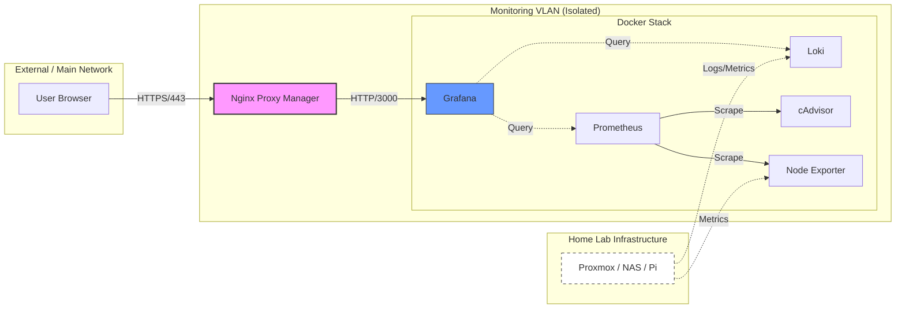

# 📊 Monitoring Stack

A production-grade observability suite deployed via **GitHub Actions** to a **Raspberry Pi 4 8GB RAM**. This stack provides a "Single Pane of Glass" for monitoring a distributed home lab infrastructure, AI workloads (RTX 3090 Ti), and 20+ containerized applications.

> [!NOTE]
> This is an open-source template. Your private secrets and credentials are managed via GitHub Secrets — never commit `.env` files.

---

## 🏗️ Architecture Overview

This monitoring stack utilizes a **Hybrid Storage Strategy** to balance high-performance metric ingestion with long-term data resilience.

* **Prometheus**: Time-series database running on local **EXT4 SSD storage** to ensure high IOPS and prevent TSDB corruption common with network filesystems.
* **Grafana & Loki**: Data persisted directly to a **15TB NAS (NFS Mount)** for high-capacity log retention and dashboard persistence.
* **Automated Backups**: Nightly snapshots of Prometheus data are pushed to the NAS via an automated script, providing 3-2-1 backup methodology.
* **Observability**: Integrated monitoring for a distributed Proxmox cluster, AI workloads (**RTX 3090 Ti**), and 20+ containerized applications.


```mermaid
graph LR
    subgraph "External / Main Network"
        User[User Browser]
    end

    subgraph "Monitoring VLAN (Isolated)"
        NPM[Nginx Proxy Manager]
        
        subgraph "Docker Stack"
            Grafana[Grafana]
            Prom[Prometheus]
            Loki[Loki]
            cAdvisor[cAdvisor]
            NodeExp[Node Exporter]
        end
    end

    subgraph "Home Lab Infrastructure"
        Servers[Proxmox / NAS / Pi]
    end

    %% Access Flow
    User -->|HTTPS/443| NPM
    NPM -->|HTTP/3000| Grafana

    %% Data Query Flow
    Grafana -.->|Query| Prom
    Grafana -.->|Query| Loki

    %% Collection & Production Flow
    Prom -->|Scrape| cAdvisor
    Prom -->|Scrape| NodeExp
    Servers -.->|Logs/Metrics| Loki
    Servers -.->|Metrics| NodeExp
    
    %% Styling
    style NPM fill:#f9f,stroke:#333,stroke-width:2px
    style Grafana fill:#69f,stroke:#333
    style Servers fill:#fff,stroke:#333,stroke-dasharray: 5 5
```

---

## 🚀 Automated Deployment (CI/CD)

This project uses a **GitOps** approach. Changes pushed to the `main` branch trigger a GitHub Actions workflow that:

### CI Pipeline (every push/PR)
1. **YAML Syntax Validation** — validates docker-compose.yml and prometheus.yml
2. **Docker Compose Config Validation** — ensures compose file parses correctly
3. **Secret Detection Scan** — prevents accidental commits of credentials
4. **Port Conflict Detection** — validates no duplicate port mappings
5. **Resource Limit Validation** — checks memory constraints are defined
6. **Service Dependency Check** — verifies depends_on relationships are valid
7. **Image Reference Validation** — confirms all images are referenced correctly
8. **Volume Path Consistency Check** — validates mount configurations
9. **Prometheus Config Validation** — checks scrape_configs and targets
10. **Targets JSON Validation** — validates scrape target structure
11. **Script Syntax Validation** — checks shell scripts for syntax errors
12. **Test Report Generation** — summarizes health check coverage

### CD Pipeline (main branch push only)
1. **Pre-flight Checks** — verifies SSH/SCP availability and secrets configuration
2. **SSH Key Preparation** — sets up passwordless auth to Raspberry Pi
3. **File Sync via SCP** — transfers all config files to the target host
4. **Remote Docker Deployment** — pulls images, recreates containers
5. **Post-deploy Health Check** — validates all services are responding

### GitHub Secrets Required

| Secret | Description |
|--------|-------------|
| `PI_HOST` | IP or hostname of your Raspberry Pi |
| `PI_USERNAME` | SSH username for the Raspberry Pi |
| `SSH_PRIVATE_KEY` | SSH private key (ed25519 recommended) for passwordless auth |
| `GRAFANA_PASSWORD` | Admin password for Grafana |

### GitHub Repository Variables

| Variable | Description | Example |
|----------|-------------|---------|
| `DOMAIN` | Your base domain for services | `home.lab` |
| `NAS_LOG_PATH` | NAS mount path for logs/data | `/mnt/nas/monitoring` |

### Self-Hosted Runner

The deployment job requires a **self-hosted GitHub Actions runner** on your Raspberry Pi:

```yaml
# .github/workflows/deploy.yml uses:
#   runs-on: [self-hosted, Linux, X64, home-lab]
```

To set up the runner, follow the [GitHub Actions self-hosted runner documentation](https://docs.github.com/en/actions/hosting-your-own-runners/managing-self-hosted-runners/adding-self-hosted-runners).

---

## 📦 Services

| Service | Image | Port | Purpose |
|---------|-------|------|---------|
|| **Prometheus** | `prom/prometheus:latest` | 9090 | Time-series metrics collection |
|| **Grafana** | `grafana/grafana:latest` | 3000 | Dashboards and visualization |
|| **Loki** | `grafana/loki:latest` | 3100 | Log aggregation |
|| **cAdvisor** | `gcr.io/cadvisor/cadvisor:latest` | 8080/8081 | Container resource usage |
|| **Node Exporter** | `prom/node-exporter:latest` | 9100 | Host-level hardware metrics |
|| **Alertmanager** | `prom/alertmanager:latest` | 9093 | Alert routing & notifications |
|| **Blackbox Exporter** | `prom/blackbox-exporter:latest` | 9115 | HTTP/TCP/ICMP service probes |

### Provisioned Dashboards

| Dashboard | Description | GPU Support |
|-----------|-------------|-------------|
| **Infrastructure Overview** | CPU, memory, disk, network across all hosts | ❌ |
| **GPU Monitoring** | Legacy NVIDIA node_exporter metrics | ✅ NVIDIA |
| **AI Infrastructure Monitoring** | AI node health, GPU fleet, inference metrics | ✅ NVIDIA + AMD |
| **AIOps Engine** | Alert analysis, LLM analysis rate & remediation | ❌ |
| **Homelab System Overview** | Proxmox hypervisor-specific metrics | ❌ |

---

## 💾 Storage & Backup Strategy

| Data Type | Primary Storage | Backup Target | Strategy |
| :--- | :--- | :--- | :--- |
| **Prometheus TSDB** | Local SSD (EXT4) | 15TB NAS (NFS) | Nightly Admin API Snapshots |
| **Grafana DB** | 15TB NAS (NFS) | NAS RAID | Direct Persistence |
| **Loki Logs** | 15TB NAS (NFS) | NAS RAID | Direct Persistence |

### Automated Backups

A custom bash script (`scripts/backup_prometheus.sh`) runs nightly via Cron. It:
1. Triggers a Prometheus TSDB snapshot via the **Admin API**.
2. Verifies the NAS mount point is active to protect local SSD capacity.
3. Syncs the snapshot to the NAS using `rsync` with automated ownership correction.
4. Purges local snapshots older than 7 days to maintain SSD health.

---

## 🌐 Networking Configuration

To ensure compatibility with an external **Nginx Proxy Manager (NPM)** VM, services are bound to the host's LAN IP.

| Service | Internal Port | External Port | Access URL |
| :--- | :--- | :--- | :--- |
| **Grafana** | 3000 | 3000 | `grafana.domain.com` |
| **Prometheus** | 9090 | 9090 | `prometheus.domain.com` |
| **cAdvisor** | 8080 | 8081 | `cadvisor.domain.com` |
| **Loki** | 3100 | 3100 | `loki.domain.com` |

> [!NOTE]
> **cAdvisor** is mapped to `8081` on the host to avoid conflicts with local Nginx services, but Prometheus scrapes it internally on `8080` via the Docker bridge network.

> [!IMPORTANT]
> **Prometheus Admin API** is enabled (`--web.enable-admin-api`) to facilitate automated snapshots. Access is restricted via Nginx Proxy Manager and internal VLAN isolation.

---

## 🎯 Scrape Targets

The stack currently monitors **30+ endpoints** across the lab:

| Category | Count | Details |
|----------|-------|---------|
| **Hypervisors** | 3 | Proxmox virtualization nodes |
| **GPU Nodes** | 2 | NVIDIA RTX + AMD Radeon (DCGM + hwmon) |
| **App Services** | 15+ | Containers, VMs, LXCs |
| **DNS Servers** | 2 | Primary + secondary DNS |
| **Blackbox Probes** | 5+ | HTTP/TCP availability checks |
| **cAdvisor** | 1 | Container resource monitoring |

### GPU Monitoring Architecture

**NVIDIA GPUs** — Uses NVIDIA DCGM exporter (`nvcr.io/nvidia/k8s/dcgm-exporter`):
- GPU utilization, memory usage, temperature, power draw, clock speeds
- Dedicated `nvidia_gpu` Prometheus scrape job

**AMD GPUs** — Lightweight hwmon textfile collector:
- Busy %, VRAM used/total, temperature, power, fan speed, clocks
- Collected via Node Exporter's `--collector.textfile.directory` with cron
- Metrics named `amdgpu_*` (e.g., `amdgpu_temperature_celsius`)

### Adding New Targets

Update `targets.json` and push to main:

```json
{
  "targets": ["new-service.your-domain:9100"],
  "labels": { "job": "new_category" }
}
```

---

## 🛠️ Local Development & Testing

You can run the full CI validation locally using `act`:

```bash
# Install act (if not installed)
brew install act

# Run CI checks locally
act ci

# Run the full pipeline (CI + deploy)
act push
```

Or manually validate configurations:

```bash
# Validate docker-compose.yml
docker compose config --quiet

# Validate prometheus.yml
docker run --rm -v $(pwd):/config prom/prometheus:latest --config.file=/config/prometheus.yml --dry-run

# Check for port conflicts
docker compose ps  # should show no conflicts
```

---

## 🛠️ Maintenance Cheatsheet

**Reset Grafana Admin Password:**
```bash
docker exec -it grafana grafana cli admin reset-admin-password 'your-new-password'
```

**Check Prometheus Scrape Status:**
Visit `http://<pi-ip>:9090/targets` to verify all endpoints are `UP`.

**View Logs:**
```bash
docker compose logs -f [service_name]
```

**Manually Trigger Prometheus Backup:**
```bash
~/docker/monitoring/scripts/backup_prometheus.sh
```

**Verify Last Night's Backup:**
```bash
ls -lh /mnt/monitoring/backups/prometheus
```

**Check Backup Logs:**
```bash
tail -f ~/docker/monitoring/backup.log
```

---

## ♻️ Disaster Recovery (Restore Procedure)

In the event of a local SSD failure or data corruption, follow these steps to restore Prometheus from a NAS snapshot:

1. **Stop the Service**:
   ```bash
   docker compose stop prometheus
   ```
2. **Clear Corrupted Data**:
   ```bash
   sudo rm -rf ~/docker/monitoring/prometheus_data/data/*
   ```
3. **Restore from NAS**:
   Find the latest snapshot on your NAS and sync it back to the local SSD:
   ```bash
   # Replace [SNAPSHOT_NAME] with your target folder
   sudo rsync -av /mnt/monitoring/backups/prometheus/[SNAPSHOT_NAME]/ ~/docker/monitoring/prometheus_data/data/
   ```
4. **Fix Permissions**:
   Ensure the Prometheus user (`65534`) owns the restored files:
   ```bash
   sudo chown -R 65534:65534 ~/docker/monitoring/prometheus_data/data
   ```
5. **Restart Service**:
   ```bash
   docker compose up -d prometheus
   ```

---

## 🔒 Security Note

This stack is designed for a hardened home lab environment. It assumes:

**Network Isolation:** All containers run on a dedicated Monitoring VLAN.

**Reverse Proxy:** Traffic is handled via an internal Nginx Proxy Manager (NPM).

**Encryption:** Forced HTTPS/SSL via local certificates; all port 80/HTTP traffic is blocked at the firewall level.

**Access Control:** No direct WAN exposure; access is restricted to local/VPN clients.

**CI/CD Security:**
- Secrets are stored in GitHub Secrets, never in code
- `.env` files are gitignored
- All deployments require CI validation to pass first
- Self-hosted runner runs on isolated network

---

## 📁 Project Structure

```
monitoring-stack/
├── .github/
│   └── workflows/
│       └── deploy.yml          # CI/CD pipeline (validated on every push)
├── scripts/
│   └── backup_prometheus.sh    # Automated backup script
├── .env.example                # Environment variable template
├── .gitignore
├── docker-compose.yml          # Service definitions
├── prometheus.yml              # Prometheus scrape configuration
├── targets.json                # Dynamic scrape targets
└── README.md                   # This file
```

---

Maintained by Nicolas Teixeira | 2026